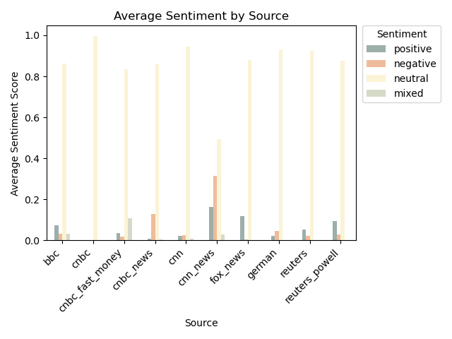
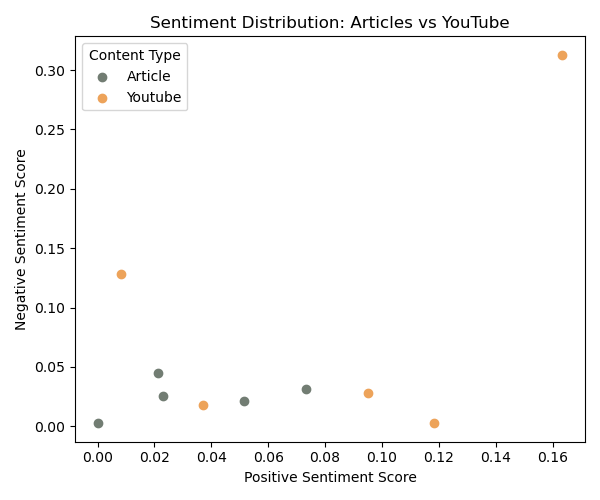
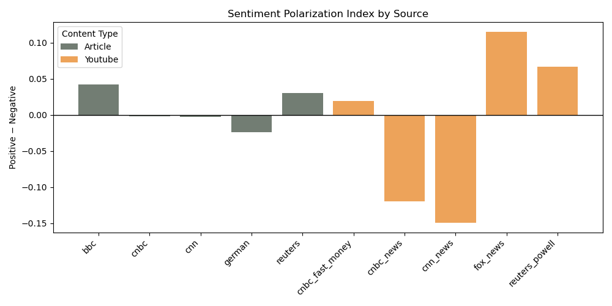

# Sentiment Analysis of Federal Reserve Rate Cut Coverage Using AWS

## Introduction

Following the recent Federal Reserve interest rate cut, financial news outlets and analysts produced extensive coverage through written articles and video commentary. While these sources report on the same economic event, differences may arise in tone, framing, and emotional emphasis.

This project analyzes sentiment across major news outlets and compares written reporting with spoken commentary from YouTube videos. Managed AWS services are used to process multilingual text, transcribe audio content, and extract sentiment indicators in a reproducible data engineering pipeline.

---

## Research Question

How does sentiment differ across major news outlets when covering the same Federal Reserve interest rate decision, and how does sentiment in spoken commentary compare to written reporting?

---

## Data Sources

### News Articles
- CNN
- CNBC
- Reuters
- BBC
- Der Standard (German-language article, translated to English)

### YouTube Videos
- Fox News
- CNN
- CNBC (Fast Money and News segments)
- Reuters (Federal Reserve Chair press conference)

---

## AWS Services Used

This project relies on AWS managed services to process textual and audio-based news content in a scalable and reproducible manner.

- **Amazon S3**  
 Serves as centralized cloud storage for all raw inputs and processed outputs. This includes scraped article texts, translated content, uploaded audio files, transcription outputs, sentiment results, cost summaries, and generated visualizations. Centralized storage ensures reproducibility and prevents unnecessary reprocessing.

- **Amazon Translate**  
 Used to translate non-English news articles into English. This step standardizes all textual inputs before sentiment analysis, ensuring that observed sentiment differences are not driven by language effects.

- **Amazon Comprehend**  
  Applied to extract sentiment information from text. The service provides probabilistic sentiment scores, allowing fine-grained comparison across sources and content formats rather than relying on a single categorical label.
  
- **Amazon Transcribe**  
  Converts spoken commentary from YouTube news videos into text. This enables spoken content to be analyzed using the same sentiment framework as written articles, allowing direct comparison between media formats.
  
----

## Methodology and Tools

# Methodology and Tools

The analysis follows a structured data engineering workflow designed to enable consistent sentiment comparison across both publishers and content formats.

The workflow consists of the following stages:

1. News articles are collected from publisher websites through automated web scraping.
2. Articles published in languages other than English are translated into English.
3. Spoken news commentary from YouTube videos is transcribed into text.
4. Sentiment scores are extracted from all textual content using a unified model.
5. Raw inputs and processed outputs are stored in cloud-based storage.
6. Sentiment results are aggregated, visualized, and interpreted.

All processing steps are implemented in **Python**, while AWS services provide the underlying machine learning and storage infrastructure. This separation ensures that business logic remains transparent while computational complexity is delegated to managed services.

---

### Data Collection: News Articles

News articles are collected directly from publisher websites by extracting the main textual content of each article.  
This step focuses on capturing the full narrative text while excluding navigation elements, advertisements, and metadata.

The extracted text serves as the primary input for both translation and sentiment analysis.


```python

def scrape_article(url):
    response = requests.get(url, timeout=10)
    soup = BeautifulSoup(response.text, "html.parser")
    return " ".join(
        p.get_text(strip=True) for p in soup.find_all("p")
    )

```
---
### Speech-to-Text Transcription with Amazon Transcribe

Spoken commentary from YouTube news videos is converted into text using **Amazon Transcribe**.  
Each audio file is uploaded to Amazon S3 and processed through an asynchronous transcription job.


```python
transcribe.start_transcription_job(
    TranscriptionJobName=job_name,
    Media={"MediaFileUri": s3_uri},
    MediaFormat="mp3",
    LanguageCode="en-US"
)
```
Once transcription is complete, the resulting text is retrieved and integrated into the analysis pipeline. This approach enables direct comparison between written journalism and spoken commentary using identical sentiment metrics.

```python
job = transcribe.get_transcription_job(
    TranscriptionJobName=job_name
)

transcript_url = job["TranscriptionJob"]["Transcript"]["TranscriptFileUri"]
transcript_text = requests.get(transcript_url).json()[
    "results"]["transcripts"][0]["transcript"]
```
After speech-to-text processing is completed, transcription outputs are stored both locally and in Amazon S3. This step ensures that intermediate results are preserved and can be reused without rerunning the transcription process.

```python
os.makedirs("output/txt", exist_ok=True)

transcript_path = f"output/txt/{source_name}_transcript.txt"
with open(transcript_path, "w", encoding="utf-8") as f:
    f.write(transcript_text)

s3.upload_file(
    transcript_path,
    bucket_name,
    f"output/txt/{source_name}_transcript.txt"
)

```

### Translation with Amazon Translate

To ensure comparability across sources, all textual inputs are standardized to English.
Articles published in other languages are translated using Amazon Translate with automatic source language detection.

Only the first 4,500 characters are processed per request to comply with AWS service limits and cost considerations.

```python
response = translate.translate_text(
    Text=raw_text[:4500],
    SourceLanguageCode="auto",
    TargetLanguageCode="en"
)

translated_text = response["TranslatedText"]
```


----

### Sentiment Analysis with Amazon Comprehend

Sentiment analysis is performed using Amazon Comprehend on both written articles and transcribed video content.  
For each text input, the service returns probabilistic scores across four sentiment categories:

- **Positive**
- **Negative**
- **Neutral**
- **Mixed**

These scores form the basis for all subsequent comparisons and visualizations.
```python
sentiment = comprehend.detect_sentiment(
    Text=text[:4500],
    LanguageCode="en"
)

AWS_USAGE["comprehend_calls"] += 1
scores = sentiment["SentimentScore"]
```

In addition to the dominant sentiment label, the full score distribution is retained. These continuous scores enable fine-grained comparisons across sources and content formats and serve as the foundation for all aggregated statistics, tables, and visualizations presented in the analysis.

```python
eresults.append({({   "source": source_name,
    "content_type": content_type,
    "sentiment": sentiment["Sentiment"],
    "positive": scores["Positive"],
    "negative": scores["Negative"],
    "neutral": scores["Neutral"],
    "mixed": scores["Mixed"]
})
```

The number of sentiment analysis calls is tracked explicitly for cost estimation and reproducibility.

```python

os.makedirs("output/csv", exist_ok=True)

df = pd.DataFrame(results)
df.to_csv("output/csv/sentiment_results.csv", index=False)

s3.upload_file(
    "output/csv/sentiment_results.csv",
    bucket_name,
    "output/csv/sentiment_results.csv"
)

```
### Access to Stored Data (Amazon S3)

All raw inputs and processed outputs generated during the analysis are stored in an Amazon S3 bucket.  
This includes scraped articles, translated texts, audio transcripts, sentiment results, cost summaries, and visualizations.

S3 bucket (AWS Console – login required):  
https://s3.console.aws.amazon.com/s3/buckets/2404422-news-sentiment

Access requires valid AWS credentials and appropriate IAM permissions.
## Results and Visualizations

This section presents the results of the sentiment analysis applied to news articles and YouTube news videos discussing the recent U.S. Federal Reserve interest rate cut. Sentiment scores were generated using **Amazon Comprehend** and aggregated to compare patterns across media formats and news sources.

---

### 1. Average Sentiment: Articles vs YouTube


This figure compares the **average sentiment scores** between written news articles and YouTube news content.

**Key observations:**
- Neutral sentiment dominates both content types, indicating largely informational coverage.
- YouTube content exhibits higher positive and negative sentiment scores than articles.
- Articles show lower variation across sentiment categories, consistent with restrained reporting.

---

### 2. Average Sentiment by Source



This chart disaggregates sentiment scores by individual news source.

**Main findings:**
- Reuters and BBC articles show very high neutral sentiment.
- CNN and CNBC YouTube segments display higher negative sentiment.
- Mixed sentiment remains low across all sources.

Differences in sentiment appear more pronounced across **formats** than across publishers.

---

### 3. Sentiment Distribution: Articles vs YouTube



This scatter plot places individual observations on a **positive vs negative sentiment plane**.

**Interpretation:**
- Articles cluster near the origin, reflecting neutral tone.
- YouTube content is more dispersed, indicating stronger emotional framing.
- Several YouTube observations show pronounced negative sentiment.

---

### 4. Sentiment Balance by Source and Content Type


This diverging bar chart separates articles and YouTube content into two subplots and compares positive versus negative sentiment.

**Key insights:**
- Article sources cluster close to zero sentiment balance.
- YouTube sources show stronger asymmetry between positive and negative sentiment.
- Video content from CNN and CNBC is notably more negative than written articles.

---

### 5. Sentiment Polarization Index



The sentiment polarization index is defined as:
```
 Positive sentiment score − Negative sentiment score
```
Higher values indicate a more optimistic framing, while lower values indicate a more pessimistic framing.

### Sentiment Polarization by Source and Content Type

| Content Type | Source            | Polarization Index |
|--------------|-------------------|--------------------|
| Article      | bbc               | +0.04              |
| Article      | cnn               | ≈ 0.00             |
| Article      | cnbc              | ≈ 0.00             |
| Article      | german            | −0.02              |
| Article      | reuters           | +0.03              |
| YouTube      | cnbc_fast_money   | +0.02              |
| YouTube      | cnbc_news         | −0.12              |
| YouTube      | cnn_news          | −0.15              |
| YouTube      | fox_news          | +0.11              |
| YouTube      | reuters_powell    | +0.07              |

*Source: `output/csv/sentiment_polarization_table.csv`*

---


Several clear patterns emerge from the sentiment polarization table.

#### Articles: Low Polarization and Neutral Framing

Written news articles exhibit polarization values clustered tightly around zero. This indicates a predominantly neutral framing of Federal Reserve interest rate decisions across publishers. Minor deviations in either direction suggest limited emotional emphasis, consistent with traditional journalistic norms in economic reporting.

Notably:
- BBC and Reuters articles show slightly positive polarization.
- The German-language article displays a marginally negative tone after translation.
- Overall variance among articles remains low.

#### YouTube Content: Stronger Emotional Framing

In contrast, YouTube news content demonstrates substantially higher dispersion in polarization values. Both strongly positive and strongly negative sentiment framing appear within video-based sources.

Key observations include:
- CNN and CNBC video segments exhibit pronounced negative polarization.
- Fox News content shows a strong positive polarization.
- Reuters’ video content lies between these extremes.

This pattern suggests that video-based news formats emphasize emotional framing more aggressively than written articles, likely due to differences in audience engagement strategies and presentation style.

#### Content Format vs Publisher Identity

Importantly, sentiment differences are driven more by **content format** than by publisher identity. The same media organizations often display neutral sentiment in written articles but polarized sentiment in video content. This indicates that the medium itself plays a central role in shaping sentiment expression around monetary policy topics.


**Results:**
- Articles generally have polarization values close to zero.
- YouTube sources exhibit both strong positive and strong negative polarization.
- The most polarized content is concentrated in video-based sources.

---

### 6. Sentiment Composition by Source


This stacked bar chart displays the **average sentiment composition** for each source.

**Key takeaways:**
- Neutral sentiment dominates across all sources.
- YouTube content allocates a larger share to positive and negative sentiment.
- Mixed sentiment remains consistently small.

---


#### Summary of Findings

Across all figures and tables:

- Written news articles present monetary policy decisions in a predominantly neutral tone.
- YouTube news content exhibits stronger emotional framing and greater sentiment variance.
- Differences in sentiment are driven more by **content format** than by publisher identity.

These results suggest that the medium plays a central role in shaping sentiment around economic news.


---

## AWS Cost Estimation

This project relies on AWS free-tier and low-cost managed services.  
Service usage is tracked programmatically during pipeline execution and combined with official AWS on-demand unit pricing to produce transparent and reproducible cost estimates.

Specifically:
- **Amazon Translate** costs are calculated based on the number of characters translated.
- **Amazon Comprehend** costs are derived from the number of sentiment analysis API calls.
- **Amazon Transcribe** costs are computed from the total duration of processed audio (in seconds).

The total project cost is obtained by summing the individual service costs.  
All cost calculations are automatically saved to `output/csv/aws_costs.csv` and uploaded to Amazon S3, ensuring full reproducibility and auditability of cloud usage.

```python 
translate_cost = AWS_USAGE["translate_chars"] * PRICE_TRANSLATE_PER_CHAR
comprehend_cost = AWS_USAGE["comprehend_calls"] * PRICE_COMPREHEND_PER_CALL
transcribe_cost = AWS_USAGE["transcribe_seconds"] * PRICE_TRANSCRIBE_PER_SEC

total_cost = translate_cost + comprehend_cost + transcribe_cost


df_cost = pd.DataFrame([
    {"service": "Amazon Translate", "usage": AWS_USAGE["translate_chars"], "cost_usd": translate_cost},
    {"service": "Amazon Comprehend", "usage": AWS_USAGE["comprehend_calls"], "cost_usd": comprehend_cost},
    {"service": "Amazon Transcribe", "usage": AWS_USAGE["transcribe_seconds"], "cost_usd": transcribe_cost},
    {"service": "TOTAL", "usage": "", "cost_usd": total_cost}
])

df_cost.to_csv("output/csv/aws_costs.csv", index=False)

s3.upload_file(
    "output/csv/aws_costs.csv",
    bucket_name,
    "output/csv/aws_costs.csv"
)
```

### Cost Results 

| Service | Recorded Usage | Estimated Cost (USD) |
|------|---------------|---------------------|
| Amazon Translate | 1,199 characters | $0.018 |
| Amazon Comprehend | 10 API calls | $0.001 |
| Amazon Transcribe | 900 seconds audio | $0.360 |
| **Total** |  | **$0.379** |

source: `output/csv/aws_costs.csv`


The table above reflects a full successful pipeline run.  
Additional trial-and-error executions during development (debugging, testing transcription and sentiment analysis) increase usage slightly, but the **total project cost remains below $1.5**.
Based on observed development iterations, the following conservative multipliers were applied:


| Service | Final Run Cost | Trial Multiplier | Estimated Total |
|------|---------------|------------------|-----------------|
| Amazon Translate | ~$0.02 | ×6 | ~$0.04 |
| Amazon Comprehend | ~$0.01 | ×6 | ~$0.04 |
| Amazon Transcribe | ~$0.36 | ×3 | ~$0.54 |
| **Total Estimated Cost** |  |  | **~$1.26** |
---

### Reproducibility

This project is fully reproducible using the provided code and documentation.

**Steps to reproduce the analysis:**
1. Clone the GitHub repository.
2. Create and activate a Python virtual environment.
3. Install dependencies listed in `requirements.txt`.
4. Configure AWS credentials using an IAM user with access to S3, Translate, Comprehend, and Transcribe.
5. Run `DE1_HW_AWS_Script.py` to generate sentiment results and cost estimates.
6. Run `plots.py` to generate all figures and tables.

All outputs are saved locally under the `output/` directory and uploaded to Amazon S3.  
No AWS credentials are included in this repository.
